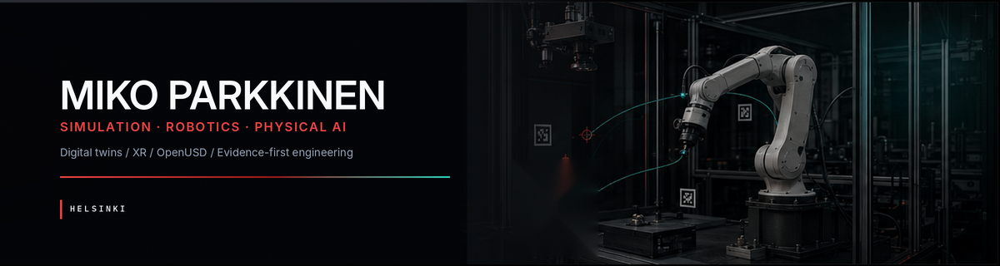
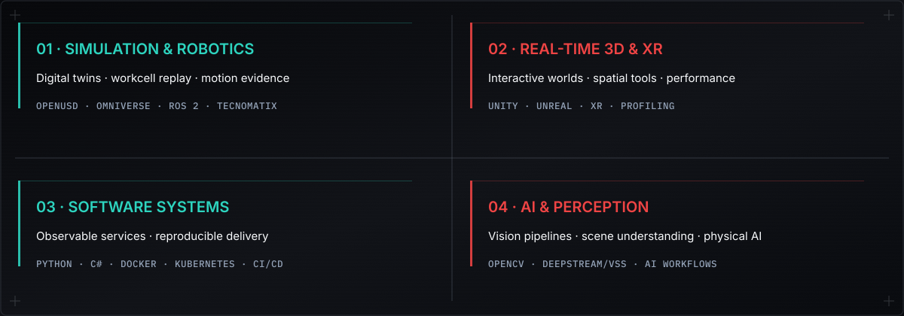
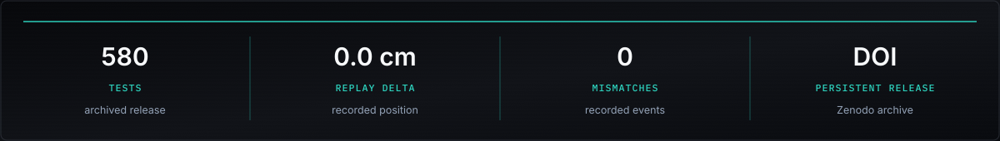
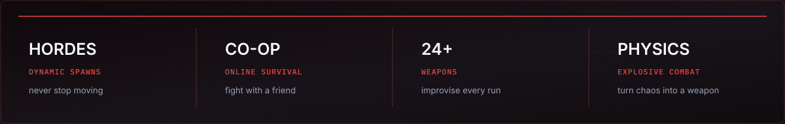

  

  
  
  
  

  <a href="#capability-map">Capabilities</a> ·
  <a href="#open-source-impact">Open source</a> ·
  <a href="#selected-work">Selected work</a> ·
  <a href="#contact">Contact</a>

I build software where **virtual worlds meet physical systems**: simulation, robotics, digital twins, XR, computer vision, and production real-time 3D. I focus on explicit interfaces, observable behavior, reproducible results, and systems another engineer can inspect and trust.

---

## Capability map

  

---

## Open-source impact

  
  
  
  

Maintainer of the [Metriplane conda-forge feedstock](https://github.com/conda-forge/metriplane-feedstock), with focused, regression-covered fixes merged into [ROS 2](https://github.com/ros2/rclpy/pull/1735), [Newton Physics](https://github.com/newton-physics/newton/pull/3900), and [Microsoft TypeSpec](https://github.com/microsoft/typespec/pull/12042).

---

## Selected work

### 01 / [Metriplane](https://github.com/Miko997/metriplane) — replayable physical evidence

  
  
  
  

  

Metriplane is an open-source, observe-only workcell black box that converts replayed or calibrated state into physical events, incident reports, portable evidence bundles, local verification, and generated regression checks.

  

**[View repository](https://github.com/Miko997/metriplane)** · [Project site](https://www.metriplane.com/) · [3-minute demo](https://www.youtube.com/watch?v=7U5nbBbGGbw) · [Reproduce v0.2.0](https://github.com/Miko997/metriplane#quick-reproduction-path) · [Zenodo DOI](https://doi.org/10.5281/zenodo.20736619)

---

### 02 / [Cursed Dawn](https://store.steampowered.com/app/2713550/Cursed_Dawn/) — brutal wave-survival FPS

  
  
  
  

  

**Cursed Dawn** drops you into secret-packed maps where dynamic zombie hordes punish every pause. Master the routes, keep moving, and improvise with more than two dozen weapons and physics-driven explosives—solo or with a friend in online co-op.

  

**[Play on Steam](https://store.steampowered.com/app/2713550/Cursed_Dawn/)** · [Watch the launch trailer](https://www.ign.com/videos/cursed-dawn-official-launch-trailer)

---

## Contact

Open to thoughtful technical collaboration around **simulation, robotics, Physical AI, XR, and real-time 3D**.

  
  

  Helsinki, Finland · Simulation · Robotics · Physical AI · Real-time 3D

