  

  <a href="#engineering-activity">Activity</a> ·
  <a href="#open-source-impact">Open source</a> ·
  <a href="#selected-work">Selected work</a> ·
  <a href="#contact">Contact</a>

I build software **where simulated environments meet physical systems**: robotics, digital twins, real-time simulation, and the infrastructure that makes their behavior observable and repeatable. My focus is on clear interfaces, reliable integration, and engineering evidence that another person can inspect and reproduce.

## Engineering activity

<picture>
  <source media="(prefers-reduced-motion: reduce)" srcset="./assets/generated/contribution-core-static.svg" />
  
</picture>

Real GitHub data, refreshed every 30 minutes and on profile updates. Calendar and streak include all contribution types, not just commits. Private counts follow my GitHub visibility settings; repository names and contents are never requested. [Data and definitions](./docs/PROFILE_SYSTEM.md) · [Refresh status](https://github.com/Miko997/Miko997/actions/workflows/profile.yml)

## Open-source impact

  

Creator of **[Metriplane](https://github.com/Miko997/metriplane)** and maintainer of its **[conda-forge feedstock](https://github.com/conda-forge/metriplane-feedstock)**. I contribute focused fixes and regression coverage to simulation, robotics, geometry and developer tooling.

<!-- IMPACT:START -->
Public upstream contributions are being verified by the profile workflow. No example counts are shown.
<!-- IMPACT:END -->

## Selected work

### 01 / Metriplane
**Recorded incidents → inspectable evidence → repeatable regression checks.**

  

An open-source, **observe-only** system for analyzing recorded workcell behavior. Timestamped state and process rules become incident timelines, integrity-verifiable evidence bundles, and regression checks an engineer can run again. It does not control machinery or make safety decisions.

  
  
  

[Quickstart](https://github.com/Miko997/metriplane#quickstart) · [Watch the workcell demo](https://youtu.be/DGbQN8-sdLY)

### 02 / Cursed Dawn
**Real-time 3D, gameplay systems, physics — shipped as a playable product.**

  

A released wave-survival FPS developed through **Cursed Studios**. Dynamic hordes, physics-driven combat, and online co-op: a different application of the same interest in interactive systems, performance, and building software people can use.

  
  

## Contact

Interested in **simulation architecture, robotics infrastructure, physical AI evaluation, and reproducible engineering**.

**[Email](mailto:Miko.Parkkinen99@gmail.com)** · [Metriplane](https://www.metriplane.com/) · [Publications and research](https://orcid.org/0009-0008-5214-0984)

  

Helsinki, Finland · Software engineering · Independent research · Open source

