  

  <a href="#engineering-activity">Activity</a> ·
  <a href="#open-source-impact">Open source</a> ·
  <a href="#selected-work">Selected work</a> ·
  <a href="#contact">Contact</a>

I build software **where simulated environments meet physical systems**: robotics, digital twins, real-time simulation, and the infrastructure that makes their behavior observable and repeatable. My focus is on clear interfaces, reliable integration, and engineering evidence that another person can inspect and reproduce.

## Engineering activity

<picture>
  <source media="(prefers-reduced-motion: reduce)" srcset="./assets/generated/contribution-core-static.svg?v=bba68b2aa0cf" />
  
</picture>

Real GitHub data, refreshed every 30 minutes and on profile updates. Calendar and streak include all contribution types, not just commits. Private counts follow my GitHub visibility settings; repository names and contents are never requested. [Data and definitions](./docs/PROFILE_SYSTEM.md) · [Refresh status](https://github.com/Miko997/Miko997/actions/workflows/profile.yml)

## Open-source impact

  

Creator of **[Metriplane](https://github.com/Miko997/metriplane)** and maintainer of its **[conda-forge feedstock](https://github.com/conda-forge/metriplane-feedstock)**. I contribute focused fixes and regression coverage to simulation, robotics, geometry and developer tooling.

<!-- IMPACT:START -->
**15 merged upstream PRs across 11 public repositories.** Open work is listed separately; it is not counted as merged.

| Project | Merged | Recent contribution |
| :--- | ---: | :--- |
| [newton-physics/newton](https://github.com/newton-physics/newton) | 4 | [Benchmark full and partial environment resets](<https://github.com/newton-physics/newton/pull/4205>) |
| [ros2/rclcpp](https://github.com/ros2/rclcpp) | 1 | [Preserve wait-set ownership when removal fails](<https://github.com/ros2/rclcpp/pull/3294>) |
| [ros2/rclpy](https://github.com/ros2/rclpy) | 1 | [Preserve worker pool after shutdown timeout](<https://github.com/ros2/rclpy/pull/1735>) |
| [ros2/rviz](https://github.com/ros2/rviz) | 1 | [Restore keyboard shortcuts after camera interaction](<https://github.com/ros2/rviz/pull/1891>) |
| [ros2/rosidl](https://github.com/ros2/rosidl) | 1 | [Handle comment delimiters in generated C headers](<https://github.com/ros2/rosidl/pull/995>) |
| [ros2/ros2cli](https://github.com/ros2/ros2cli) | 2 | [Add multicast options to ros2 doctor hello](<https://github.com/ros2/ros2cli/pull/1267>) |
| [ros-perception/point\_cloud\_transport](https://github.com/ros-perception/point_cloud_transport) | 1 | [Honor the caller default in TransportHints](<https://github.com/ros-perception/point_cloud_transport/pull/198>) |
| [mikedh/trimesh](https://github.com/mikedh/trimesh) | 1 | [Close discretized circles exactly](<https://github.com/mikedh/trimesh/pull/2599>) |
| [microsoft/typespec](https://github.com/microsoft/typespec) | 1 | [fix\(openapi3\): emit valid deprecated parameter directives](<https://github.com/microsoft/typespec/pull/12042>) |
| [conda-forge/staged-recipes](https://github.com/conda-forge/staged-recipes) | 1 | [Add metriplane](<https://github.com/conda-forge/staged-recipes/pull/34480>) |
| [ros/rosdistro](https://github.com/ros/rosdistro) | 1 | [Add metriplane to Jazzy](<https://github.com/ros/rosdistro/pull/53151>) |

Open upstream work · 15 PRs

| Project | Pull request | State |
| :--- | :--- | :--- |
| edt-community/awesome-digital-twins | [#37 · Add Metriplane](<https://github.com/edt-community/awesome-digital-twins/pull/37>) | Open — not merged |
| gazebosim/gz-sim | [#4039 · Restore dynamic plugin priorities for Physics and UserCommands](<https://github.com/gazebosim/gz-sim/pull/4039>) | Open — not merged |
| gazebosim/gz-sim | [#4038 · Fix Physics removal requested by later Update systems](<https://github.com/gazebosim/gz-sim/pull/4038>) | Open — not merged |
| google-deepmind/mujoco\_warp | [#1770 · Support physical contact coefficients for external contacts](<https://github.com/google-deepmind/mujoco_warp/pull/1770>) | Draft |
| google-deepmind/mujoco\_warp | [#1745 · Fix GJK triangle barycentric drift with a cofactor-sum denominator](<https://github.com/google-deepmind/mujoco_warp/pull/1745>) | Open — not merged |
| isl-org/Open3D | [#7594 · Preserve metric RGBD depth during scalable TSDF activation](<https://github.com/isl-org/Open3D/pull/7594>) | Open — not merged |
| Ly0n/awesome-robotic-tooling | [#60 · Add Metriplane](<https://github.com/Ly0n/awesome-robotic-tooling/pull/60>) | Open — not merged |
| moveit/moveit2 | [#3912 · Fix logger pre-shutdown callback lifetime on library unload](<https://github.com/moveit/moveit2/pull/3912>) | Open — not merged |
| newton-physics/newton | [#4616 · Add opt-in physical hydroelastic contact response](<https://github.com/newton-physics/newton/pull/4616>) | Draft |
| newton-physics/newton | [#4595 · Fix MJCF spatial tendon site-name lookup](<https://github.com/newton-physics/newton/pull/4595>) | Open — not merged |
| PixarAnimationStudios/OpenUSD | [#4257 · Keep empty collision merge names independent](<https://github.com/PixarAnimationStudios/OpenUSD/pull/4257>) | Open — not merged |
| PixarAnimationStudios/OpenUSD | [#4210 · Handle blocked mass attributes in ComputeMassProperties](<https://github.com/PixarAnimationStudios/OpenUSD/pull/4210>) | Open — not merged |
| ros-controls/ros2\_controllers | [#2690 · \[Jazzy\] Enforce action\_execution\_timeout during trajectory execution](<https://github.com/ros-controls/ros2_controllers/pull/2690>) | Open — not merged |
| ros2/rclcpp | [#3318 · Synchronize Jazzy action-server clock callback changes](<https://github.com/ros2/rclcpp/pull/3318>) | Open — not merged |
| ros2/rclcpp | [#3310 · \[Humble\] Remove pessimizing moves \(backport #2353\)](<https://github.com/ros2/rclcpp/pull/3310>) | Open — not merged |

Verified from public GitHub PR searches · 2026-10-09 · Updated automatically.
<!-- IMPACT:END -->

## Selected work

### 01 / Metriplane
**Recorded incidents → inspectable evidence → repeatable regression checks.**

  

An open-source, **observe-only** system for analyzing recorded workcell behavior. Timestamped state and process rules become incident timelines, integrity-verifiable evidence bundles, and regression checks an engineer can run again. It does not control machinery or make safety decisions.

  
  
  

[Quickstart](https://github.com/Miko997/metriplane#quickstart) · [Watch the workcell demo](https://youtu.be/DGbQN8-sdLY)

### 02 / Cursed Dawn
**Real-time 3D, gameplay systems, physics — shipped as a playable product.**

  

A released wave-survival FPS developed through **Cursed Studios**. Dynamic hordes, physics-driven combat, and online co-op: a different application of the same interest in interactive systems, performance, and building software people can use.

  
  

## Contact

Interested in **simulation architecture, robotics infrastructure, physical AI evaluation, and reproducible engineering**.

**[Email](mailto:Miko.Parkkinen99@gmail.com)** · [Metriplane](https://www.metriplane.com/) · [Publications and research](https://orcid.org/0009-0008-5214-0984)

  

Helsinki, Finland · Software engineering · Independent research · Open source

