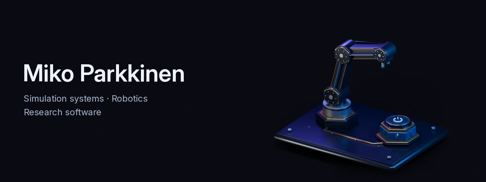

<picture>
  <source media="(max-width: 600px)" srcset="./assets/signature-header-mobile.webp" />
  
</picture>

<picture>
  <source media="(prefers-reduced-motion: reduce) and (max-width: 600px)" srcset="./assets/generated/contribution-core-mobile-static.svg?v=b2929bf96220" />
  <source media="(prefers-reduced-motion: reduce)" srcset="./assets/generated/contribution-core-static.svg?v=b2929bf96220" />
  <source media="(max-width: 600px)" srcset="./assets/generated/contribution-core-mobile.svg?v=b2929bf96220" />
  
</picture>

[Static activity view](./assets/generated/contribution-core-static.svg?v=b2929bf96220) · [Data and definitions](./docs/PROFILE_SYSTEM.md)

## Open source

<!-- IMPACT:START -->
**[Newton Physics](https://github.com/newton-physics/newton/pull/4189)** · **[ROS 2](https://github.com/ros2/rclcpp/pull/3294)** · **[Microsoft TypeSpec](https://github.com/microsoft/typespec/pull/12042)** · **[conda-forge](https://github.com/conda-forge/staged-recipes/pull/34480)** · **[trimesh](https://github.com/mikedh/trimesh/pull/2599)**
<!-- IMPACT:END -->

## Selected work

### Metriplane

An open-source, observe-only system that turns recorded workcell incidents into inspectable evidence and repeatable regression checks.

[Source](https://github.com/Miko997/metriplane) · [Project](https://www.metriplane.com/) · [Research](https://doi.org/10.5281/zenodo.20736619) · [Demo](https://youtu.be/DGbQN8-sdLY)

### Cursed Dawn

A wave-survival FPS released through Cursed Studios, with physics-driven combat and online co-op.

[Steam](https://store.steampowered.com/app/2713550/Cursed_Dawn/) · [Launch trailer](https://www.ign.com/videos/cursed-dawn-official-launch-trailer)

---

[Email](mailto:Miko.Parkkinen99@gmail.com) · [Research archive](https://doi.org/10.5281/zenodo.20736619) · Helsinki, Finland
