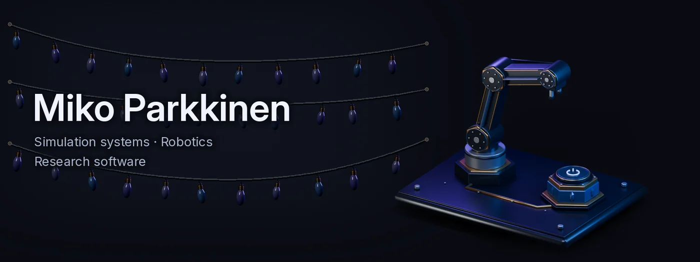
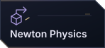
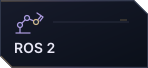
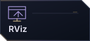
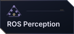
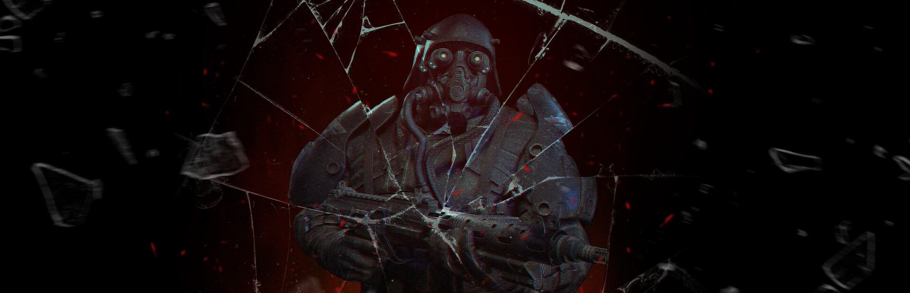

<picture>
  <source media="(prefers-reduced-motion: reduce) and (max-width: 600px)" srcset="./assets/signature-header-mobile--eff6179f4d1a.webp" />
  <source media="(prefers-reduced-motion: reduce)" srcset="./assets/signature-header--de0bfab87ea9.webp" />
  <source media="(max-width: 600px)" srcset="./assets/signature-header-mobile-animated--31cbab66682b.webp" />
  
</picture>

<picture>
  <source media="(prefers-reduced-motion: reduce) and (max-width: 600px)" srcset="./assets/generated/contribution-core-mobile-static--5a9191e0095a.svg" />
  <source media="(prefers-reduced-motion: reduce)" srcset="./assets/generated/contribution-core-static--5a9191e0095a.svg" />
  <source media="(max-width: 600px)" srcset="./assets/generated/contribution-core-mobile--5a9191e0095a.svg" />
  
</picture>

## Open source

<!-- IMPACT:START -->

<!-- IMPACT:END -->

Research software reviews for JOSS ([BlenDaViz](https://github.com/openjournals/joss-reviews/issues/11181), [VERNIER](https://github.com/openjournals/joss-reviews/issues/11292)) and pyOpenSci ([weitsicht](https://github.com/pyOpenSci/software-submission/issues/284)).

## Metriplane

An open-source, observe-only system that turns recorded workcell incidents into inspectable evidence and repeatable regression checks.

[Source](https://github.com/Miko997/metriplane) · [Project](https://www.metriplane.com/) · [SoftwareX paper](https://doi.org/10.1016/j.softx.2026.103104) · [Demo](https://youtu.be/DGbQN8-sdLY)

## Cursed Dawn

A solo-developed wave-survival FPS with physics-driven combat and online co-op, released through Cursed Studios in April 2025. Previously published with indie.io (2024–2026).

The trailer appeared at IGN Live 2024, and the game joined indie.io’s Gamescom 2024 lineup. It reached **9,900+ Steam wishlists**.

[CursedDawn.com](https://curseddawn.com/) · [IGN Live](https://www.ign.com/videos/cursed-dawn-official-trailer-ign-live-2024) · [Gamescom](https://www.gamedeveloper.com/press-release/indie-io-hits-gamescom) · [Steam record](https://store.steampowered.com/app/2713550/Cursed_Dawn/)

---

<!-- CONTACTS:START -->

<a href="https://www.linkedin.com/in/miko-parkkinen-96650822a/"><picture><source media="(prefers-reduced-motion: reduce)" srcset="./assets/links/linkedin-static--b60a4e68a96f.svg" /></picture></a>
<a href="https://orcid.org/0009-0008-5214-0984"><picture><source media="(prefers-reduced-motion: reduce)" srcset="./assets/links/orcid-static--1dddd37fe5eb.svg" /></picture></a>
<a href="https://www.youtube.com/@MikoParkkinen/videos"><picture><source media="(prefers-reduced-motion: reduce)" srcset="./assets/links/youtube-static--f785a4234cc8.svg" /></picture></a>
<a href="https://store.steampowered.com/app/2713550/Cursed_Dawn/"><picture><source media="(prefers-reduced-motion: reduce)" srcset="./assets/links/steam-static--b31ecaa66308.svg" /></picture></a>
<a href="mailto:Miko.Parkkinen99@gmail.com"><picture><source media="(prefers-reduced-motion: reduce)" srcset="./assets/links/email-static--6eafe1ce36c1.svg" /></picture></a>
<a href="https://doi.org/10.5281/zenodo.20736619"><picture><source media="(prefers-reduced-motion: reduce)" srcset="./assets/links/research-static--21e7285a54dc.svg" /></picture></a>

<!-- CONTACTS:END -->
